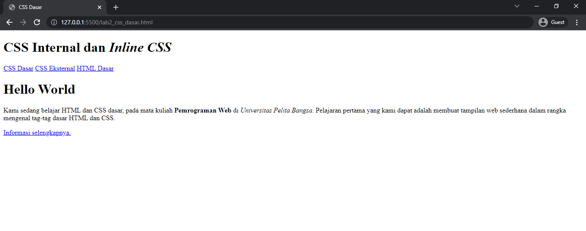
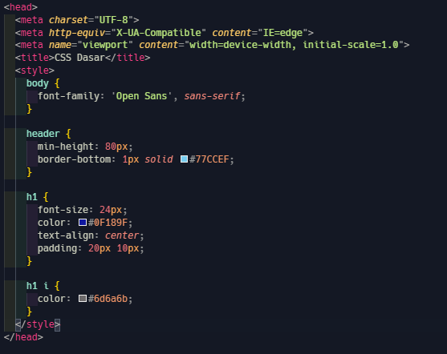
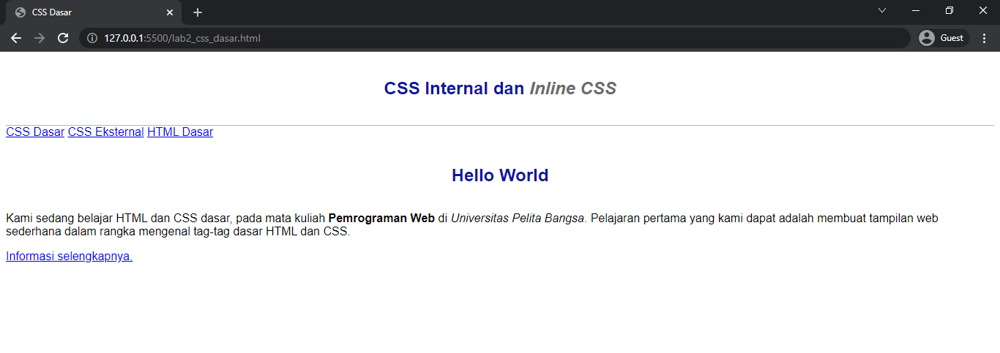
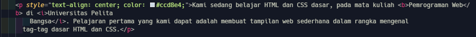
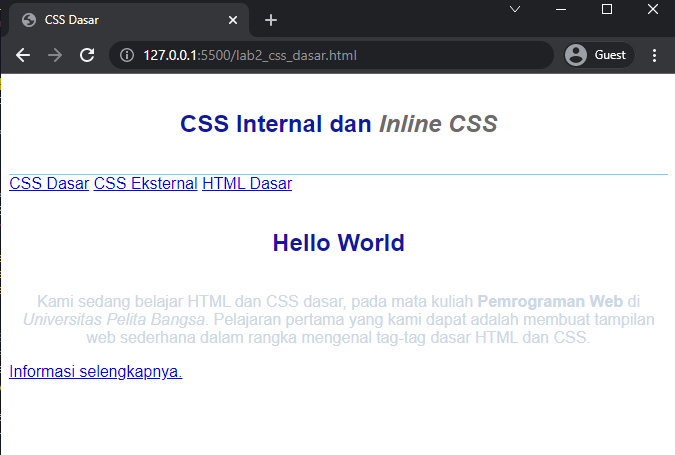
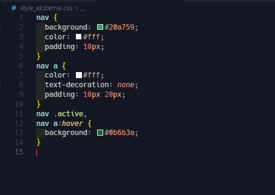
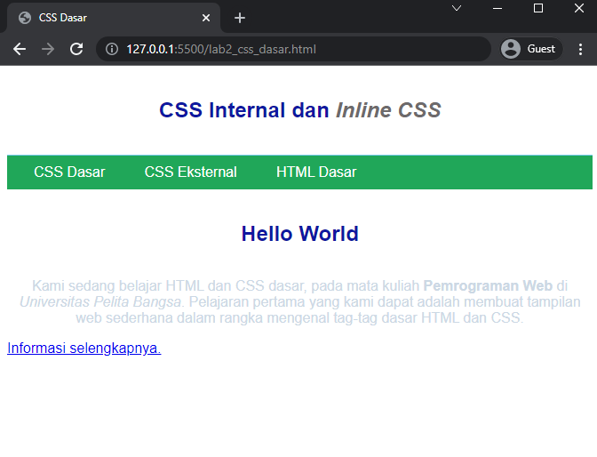
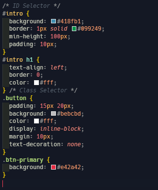
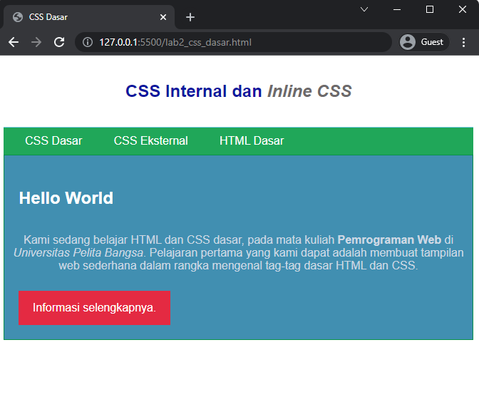

# Lab2Web
Dasar - dasar CSS
### Pengantar CSS
Cascading Style Sheet (CSS) merupakan aturan untuk mengatur beberapa komponen dalam sebuah web sehingga akan lebih terstruktur dan seragam. CSS bukan merupakan bahasa pemograman. CSS memudahkan dalam mengubah tampilan di berbagai halaman. Hanya dengan mengubah fungsi style di file CSS maka seluruh tampilan yang menggunakan fungsi tersebut akan berubah secara otomatis. CSS mempunyai atribut lebih beragam dibandingkan dengan HTML CSS memungkinkan konten dapat dioptimasi di lebih dari satu perangkat. Hampir seluruh website yang ada di internet menggunakan CSS di dalamnya. Selain tampilannya yang lebih menarik, kebanyakan browser populer saat ini juga mendukung CSS.

## Praktikum 2

1. buatlah sturuktur dasar `HTML` 

        <!DOCTYPE html>
        <html lang="en">
        <head>
          <meta charset="UTF-8">
          <meta http-equiv="X-UA-Compatible" content="IE=edge">
          <meta name="viewport" content="width=device-width, initial-scale=1.0">
          <title>Document</title>
        </head>
        <body>
  
        </body>
        </html>

2. membuat dokumen `HTML`

        <header>
          <h1>CSS Internal dan <i>Inline CSS</i></h1>
        </header>
        <nav>
          <a href="lab2_css_dasar.html">CSS Dasar</a>
          <a href="lab2_css_eksternal.html">CSS Eksternal</a>
          <a href="lab1_tag_dasar.html">HTML Dasar</a>
        </nav>

        <!-- CSS ID Selector -->
        

          <h1>Hello World</h1>
            
Kami sedang belajar HTML dan CSS dasar, pada mata kuliah <b>Pemrograman Web</b> di <i>Universitas Pelita
            Bangsa</i>. Pelajaran pertama yang kami dapat adalah membuat tampilan web sederhana dalam rangka mengenal
            tag-tag dasar HTML dan CSS.

           <!-- CSS Class Selector -->
           <a class="button btn-primary" href="#intro">Informasi
            selengkapnya.</a>
        

maka akan tampil sebagai berikut

3. menambahkan deklarasi CSS internal

Internal CSS adalah kode CSS yang ditulis dalam tag <style> dan lokasinya berada pada bagian atas header file HTML. Internal CSS digunakan untuk membuat custom khusus dalam satu halaman website sehingga halaman lain tidak terpengaruh.

4. menambahkan deklarasi CSS inline 

Inline CSS adalah memasukan kode CSS yang ditulis secara langsung pada setiap atribut HTML. Jadi setiap atribut memiliki style CSS yang berbeda tergantung kebutuhan . Inline CSS ini tergolong kurang efisien jika dibandingkan jenis CSS untuk website lainnya

        

sehingga menghasilkan 

5. membuat CSS eksternal

External CSS adalah kode CSS yang penulisannya dipisah dengan file HTML. Jadi file CSS ditulis pada file sendiri dengan ekstensi .css. File External CSS biasa dituliskan pada bagian <head>, jadi setiap halaman website dilakukan pemanggilan file css.

pertama kita membuat file css dengan nama `style_eksternal.css`

        <link rel="stylesheet" href="style_eksternal.css" type="text/css">

hubungkan menggunakan tag `link` di dalam header

maka akan tampil sebagai berikut

6. menambhakan CSS selector

CSS selector adalah salah satu rule set dari Css yang fungsinya tidak berbeda jauh dengan namanya (Selector) yakni memilih suatu elemen yang ingin anda beri gaya atau style css. Universal selector berarti memilih semua elemen yang ada pada suatu halaman HTML

kemudian save dan lihat hasil nya sebagai berikut

### CSS Reset

        *{
          padding: 0;
          margin: 0;
        }

Reset stylesheet adalah kumpulan aturan CSS yang digunakan untuk menghapus pemformatan default elemen HTML browser, menghilangkan potensi inkonsistensi antara browser yang berbeda.

